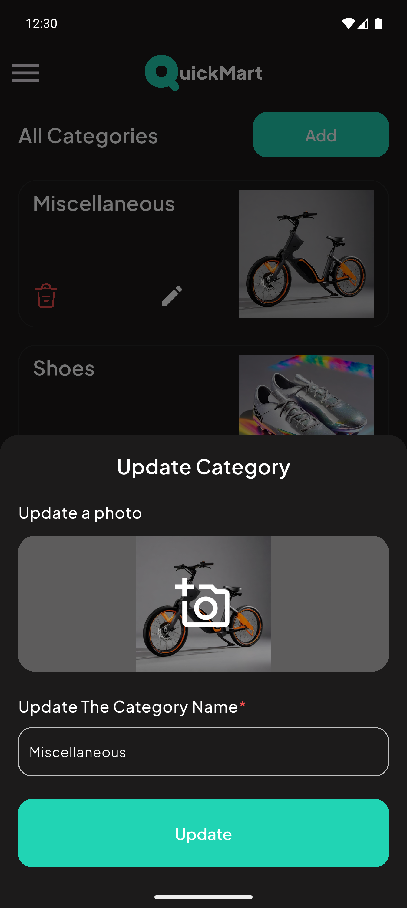

# E-Commerce App 🛍️


An intuitive and modern e-commerce app designed for both customers and admins to browse, browse, and organize product listings efficiently.

**Note:** This app uses the [Platzi Fake Store API](https://fakeapi.platzi.com/en/about/introduction/).

---

## Design Inspiration 🎨

Design Inspiration: [View Design Inspiration](https://www.figma.com/community/file/1282297701057617450)

---

## Download the App 📥

Download the APK for Android: [Download APK](https://drive.google.com/file/d/1zHcQYnuvMkiqDW6L5vSxC6uNAjbTnUmZ/view?usp=drivesdk)

---

## Features ✨

### For Customers:
- Browse products and categories.
- Search for products and filter them by price.
- Add products to the wishlist.
- Add products to the cart.
- Change between light and dark themes.

### For Admins:
- Create, update, or delete categories.
- Create, update, or delete products.
- Delete users.
- Change between light and dark themes.

---

## Screenshots

| Onboarding 1 | Onboarding 2 | Onboarding 3 | Sign Up |
|--------------|--------------|--------------|---------|
|  |  |  |  |

| Login | Home | Categories | Empty Cart |
|-------|------|-----------|------------|
|  |  |  |  |

| Cart | Empty Wishlist | Wishlist | Product Detail |
|------|--------------|---------|---------------|
|  |  |  |  |

| Latest Products | Search | Filter | Category Products |
|----------------|--------|--------|-------------------|
|  |  |  |  |

| Profile | Shipping Address | Payment | Order History |
|---------|----------------|---------|--------------|
|  |  |  |  |

| Privacy | Terms | FAQs | Change Password |
|---------|------|-----|----------------|
|  |  |  |  |

| Checkout | Logout | Home Light | Product Detail Light |
|---------|--------|------------|---------------------|
|  |  |  |  |

| Cart Light | Profile Light | Admin Dashboard | Drawer |
|-----------|-------------|----------------|--------|
|  |  |  |  |

| Admin Categories | Create Category | Update Category | Admin Products |
|----------------|---------------|---------------|--------------|
|  |  |  |  |

| Create Product 1 | Create Product 2 | Update Product | Users |
|-----------------|-----------------|---------------|------|
|  |  |  |  |


---

## Installation

Follow these steps to set up the app:

1. **Clone the repository**
    ```bash
    git clone https://github.com/Dilman01/ecommerce_app.git

    cd ecommerce_app
    ```
2. **Install dependencies**
   ```bash
    flutter pub get
   ```
3. **Generate necessary files**
   * Use the build_runner tool to generate required files:
   ```bash
    dart run build_runner build -d 
   ```
4. **Run the app**
   ```bash
    flutter run
   ```
---

## Contact
For questions or feedback, please contact dilmandev@gmail.com.
